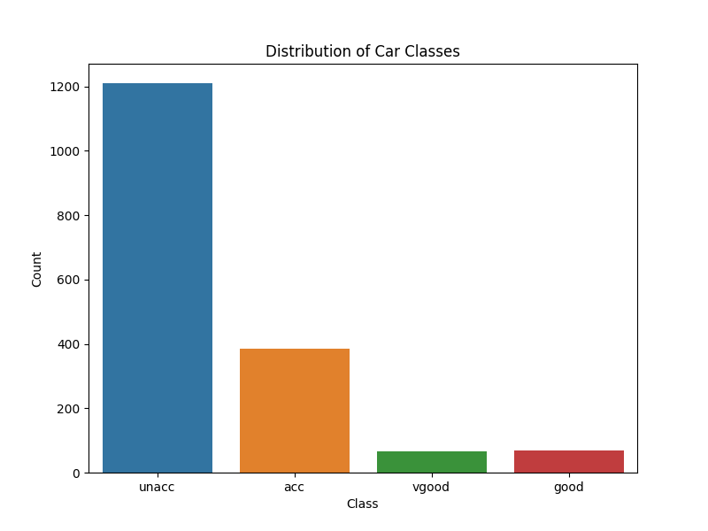
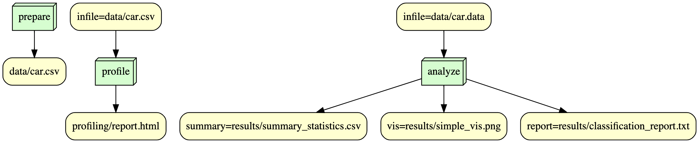

## Overview ##
This repository hosts the capstone project for IS-477: Data Management, Curation, and Reproducibility, conducted in the Fall 2023 semester. The centerpiece of this project is an in-depth examination and visualization of the Car Evaluation Dataset, obtained from the UCI Machine Learning Repository. Originating from a hierarchical decision model, this dataset offers a rich platform for studies in constructive induction and structure discovery. This analysis primarily employs a decision tree classifier to determine car acceptability, considering factors such as price, technical specifications, and safety features. Moreover, the project presents summary statistics and a graphical representation of the distribution across various car evaluation categories, shedding light on the underlying patterns and trends within the dataset.

## Contributions ##
As the sole contributor to this project, I, Deyi Zhang, have independently undertaken all aspects of the work. This includes data collection, analysis, decision tree modeling, creation of visualizations, and documentation.

## Analysis ##
The analysis of the Car Evaluation Dataset reveals interesting patterns and relationships between different car attributes and their overall acceptability. The decision tree classifier effectively identifies key factors influencing car evaluation. The summary statistics and visualizations further augment the understanding of the dataset, highlighting the distribution and variation across different car classes.

## Workflow ##

Reproducing
To reproduce this analysis, follow these step

# *Clone the repository:* #

git clone https://github.com/victordashuaibi/is477-fall2023-final-project.git

# *Install the necessary libraries:* #

pip install -r requirements.txt

# *Execute the analysis files:* #

# *Prepare the data:* #

snakemake --rulegraph prepare

# *Profile the data:* #

snakemake --rulegraph profile

# *Analyze the data:* #

snakemake --rulegraph analyze

# *Docker:* #

docker run victordashuaibi/is477-fall2023-final-project

## License ##

This project is licensed under the MIT License. This license was chosen for its permissiveness, allowing unrestricted use, modification, and distribution of the software, making it suitable for academic and open-source projects.

## References ##

Bohanec, Marko. (1997). Car Evaluation. UCI Machine Learning Repository. https://doi.org/10.24432/C5JP48.
Dataset License:

Dataset License:

Creative Commons Attribution 4.0 International (CC BY 4.0).
The dataset is open for sharing and adaptation for any purpose, with appropriate credit.